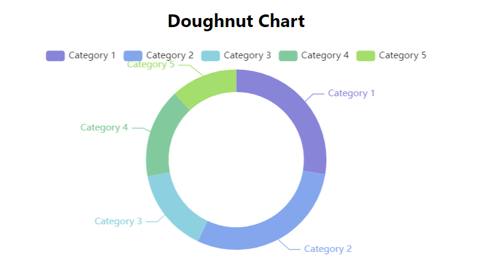
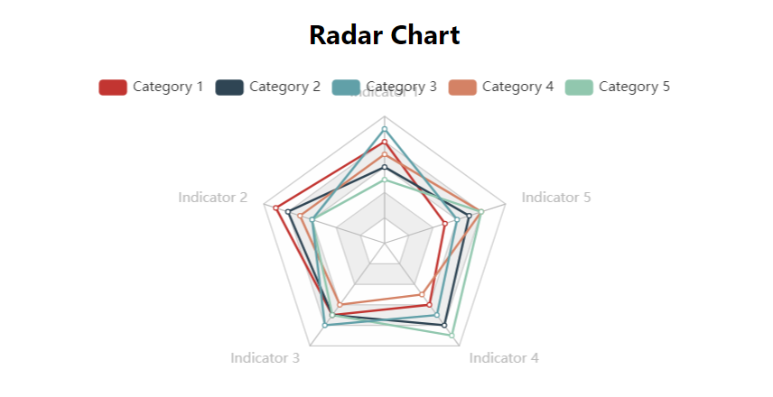
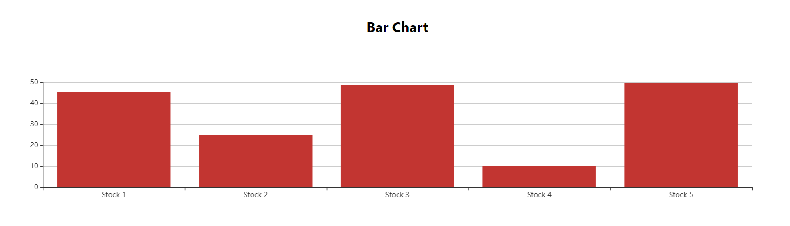
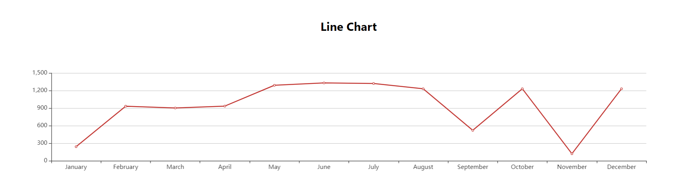

### Project Objective:

The primary goal of this initiative is to employ React.js for data visualization purposes. Leveraging the eChart.js library in JavaScript, which seamlessly integrates with React, facilitates robust support for visualization tasks.

### React

React stands as a cornerstone in the realm of open-source JavaScript libraries, meticulously maintained by Facebook. It serves as a versatile tool for crafting user interfaces (UI) and developing UI components with utmost efficiency.

### ECharts

ECharts emerges as a potent JavaScript library tailored for visualization endeavors, built upon zrender. It furnishes a straightforward mechanism for embedding intuitive, interactive, and extensively customizable charts into applications.

### Prerequisites

Before diving into the project setup, ensure that Node.js is installed on your system. If not, Node.js can be readily obtained from its official website.

### Setup Procedure

Let's kickstart the React project creation process by employing the npm package. Execute the following command in your command prompt/terminal:

`npx create-react-app visualization`

Upon successful execution, validate the functioning of the web server by following these steps:

Initiate the server:

`npm start`

Next, proceed to install and incorporate ECharts into the project by executing the subsequent commands:

`npm install - save echarts-for-react`
`npm install - save echarts`

Once again, run:

`npm start`

Voila! Witness an array of Line, Pie, and Polar charts materialize seamlessly on your web browser.

Below, you'll find snapshots showcasing the data visualizations rendered by various charts:

